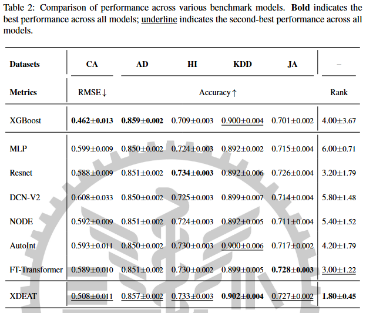
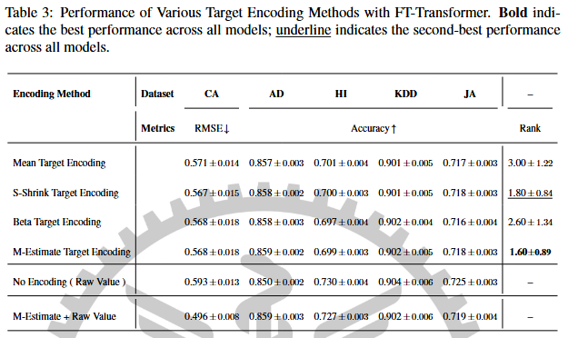
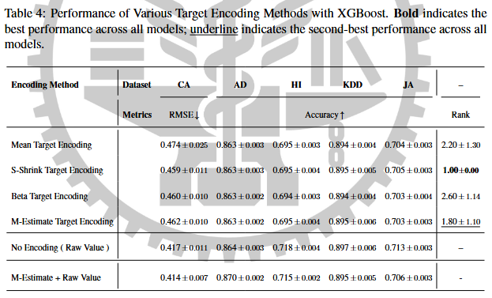
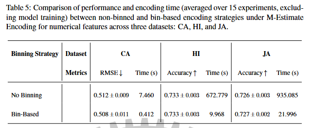
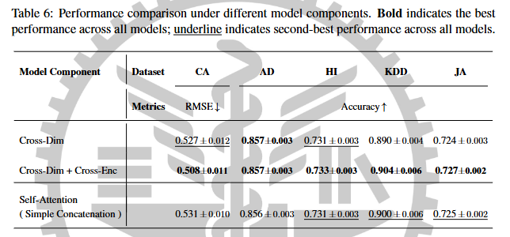

# XDEAT-Tabular-Learning ( Thesis )
Abstract: A novel framework, XDEAT (Cross-Dimensional and Cross-Encoding Attention with Target-Aware Conditioning), is proposed for supervised learning on tabular data.  At its core, XDEAT employs a dual-stream encoder that decomposes each input feature into two parallel representations: a raw value stream and a target-conditioned (label-aware) stream. These dual representations are then propagated through a hierarchical stack of attention-based modules. XDEAT integrates two key components: (1) cross-dimensional self-attention, which captures intra-view dependencies among features within each stream; (ii) cross-encoding self-attention, which enables bidirectional interaction between raw and target-aware representations. Performance improvements over strong baselines are consistently observed across multiple benchmark datasets, demonstrating the effectiveness of jointly modeling raw and target-aware views through attention-based mechanisms.

## 🛠 Environment Setup
The required dependencies are listed in **`Thesis/Experiment/requirements.txt`**.  

To create the environment and install dependencies:  

```bash
# (Optional) Create a virtual environment
...

# Install required packages
pip install -r Thesis/Experiment/requirements.txt
```

## 📂 Repository Structure
```
XDEAT-Tabular-Learning/
├── Experiment/                   
│ ├── Main Results/                 # Benchmark Models & XDEAT
│ ├── Target Encoding/              # FT-Transformer / XGBoost with Various Target Encoding
│ ├── Binning/                      # Comparson of Binning Technique on Numerical Features 
│ └── Model Variants/               # Various Model Archetictures
│ └── requirements.txt              # Required Packages
│
├── Figure/                         # Thesis Figures
├── Tables/                         # Results  
├── Cheng, Chih Chuan Thesis.pptx   # Powerpoint of Thesis 
├── Cheng, Chih Chuan Thesis.pdf    # PDF of Thesis
└── 原創性對比.pdf                   # Originality Comparison 
```

## 📊 Experiments
### 🏆 Main Results
We use **five datasets**: `AD`, `CA`, `HI`, `HA`, and `KDD`.  
The corresponding code is located in **`Thesis/Experiment/Main Results/`**.  

For each dataset, we evaluate:  
- **7 benchmark models**  
- **Our proposed method: XDEAT**  

### 🔹 Benchmark Models
Each benchmark model follows a two-step workflow:  

1. **Hyperparameter tuning**  
   - Run the `_optuna.py` script (e.g., `MLP_optuna.py`).  
   - This generates `optuna_pareto_trials.json`.  

2. **Testing with tuned config**  
   - Run the main `.py` script (e.g., `MLP.py`).  
   - This uses the saved config and produces `optuna_pareto_results.json`.  

**Example (MLP):**
```
python MLP_optuna.py   # Run Optuna to find best config
python MLP.py          # Run model with tuned config
```

### 🔹 XDEAT
For XDEAT, the workflow is similar:

1. **Hyperparameter tuning**  
   - Run the `main_tuned.py` script.  
   - This generates `optuna_pareto_trials.json`.  

2. **Testing with tuned config**  
   - Run the main `main.py` script.  
   - This uses the saved config and produces `optuna_pareto_results.json`.
  
### ⚠️ Notes
- **NODE**  
  - Not tuned with Optuna due to resource constraints.  
  - Runs with **default configuration**.  
- **XDEAT in JA**  
  - Not tuned with Optuna due to resource constraints.  
  - Runs with **default configuration**.  
- **FT_Transformer**  
  - Requires **manual configuration updates**.  
  - Its `.py` script does **not** automatically load `optuna_pareto_trials.json`.  

### 🏆 Final Results


---
### Target Encoding
### 🎯 Target Encoding

In this experiment, we evaluate different **target encoding techniques** in **FT-Transformer** and **XGBoost** to compare their performance.  
We also consider two additional settings:  
- Using **No Encoder** without target encoding  

The code is located in **`Thesis/Experiment/Target Encoding/`** and includes the following encoders:  
- **Beta Encoder**  
- **Mean Encoder**  
- **S-Shrink Encoder**  
- **M-Estimate Encoder**  

Inside each encoder folder, there are subfolders for **five datasets**: `AD`, `CA`, `HI`, `HA`, and `KDD`..  
Within each dataset, you will find:  
- `FTTransformer.py`  
- `XGBoost.py`  

### 🏆 Final Results ( FT-Transformer & XGBoost )



---
### 🧩 Binning

In this experiment, we evaluate the effect of applying a **binning strategy** before target encoding.  

- **With binning**:  
  The training dataset is first binned, and then target encoding is applied on the binned values.  

- **Without binning**:  
  Target encoding is applied directly on each feature without prior binning.  

The code is located in **`Thesis/Experiment/Binning/`**, which contains subfolders for the datasets:  
- `CA`  
- `HI`  
- `JA`  

Each dataset folder includes two subfolders:  
- **BINNING**  
- **NO_BINNING**  

Inside each folder, you can directly run to get preprocessing time and performance:  
```
python main.py
```

### 🏆 Final Results


---
### 🔀 Model Variants

In this experiment, we evaluate two different **model variants**:

1. **Cross-Dim only**  
   - Uses only the **Cross-Dim** component (without Cross-Encoding).  

2. **Simple Concatenation + One-Directional Self-Attention**  
   - Features are concatenated directly.  
   - A one-directional self-attention mechanism is applied on the data.  

The code is located in **`Thesis/Experiment/Model Variants/`**, which contains subfolders for five datasets: `AD`, `CA`, `HI`, `HA`, and `KDD`.  

To run an experiment, enter the dataset folder and execute:  
```
python ablation.py
```

### 🏆 Final Results


